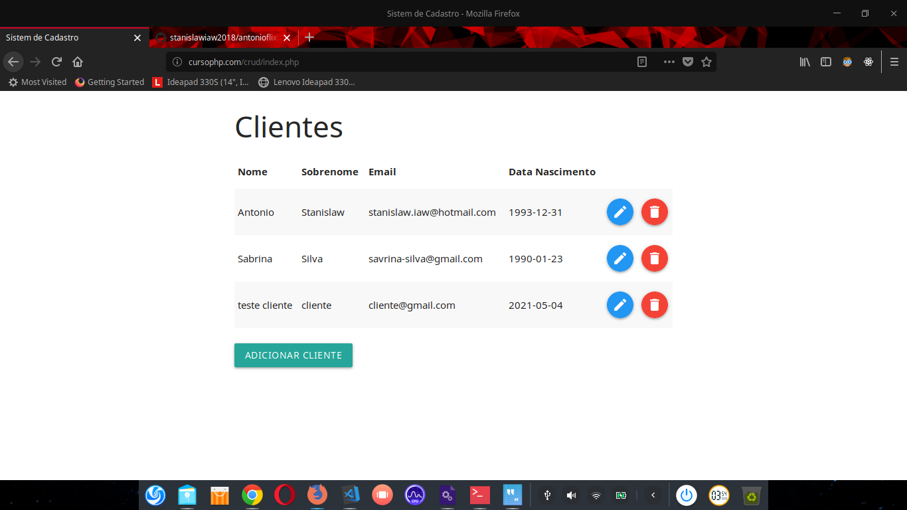

<h1 align="center">

:computer: **CRUD**: Uma simples aplicação com CRUD


<h4 align="center"> 
    
“Você nunca sai perdendo quando ganha conhecimento!”

</h4>

<h2 align="center" style="color:black"> Layout do Desafio Concluído
<h2>

<h2 align="center">

</h2>


<p align="center">
    <a href="https://www.linkedin.com/in/antonio-stanislaw-dos-santos-47a077106/">
        
    </a>
    <a href="LICENSE">
        
    </a>
</p>

<h5 align="center">
<p style="color:black">ÍNDICE</p>

[Sobre o desafio](#-Sobre-o-projeto) | [Tecnologias utilizadas](#-Tecnologias-Utilizadas) | [Como baixar o projeto](#-Como-baixar-o-projeto) | [Licença](#-Licença) | [Autor](#-Autor)

</h5>

## 🚀 Sobre o projeto

Projeto desenvolvido com o proposito de estimular o conhecimento na linguagem back-end PHP com interação com o banco de dados. A ideia desse projeto consiste na criação de um CRUD de clientes em um sistema de cadastro.


## 🛠️ Tecnologias Utilizadas

- HTML5;
- CSS3;
- JavaScript;
- PHP;
- MySQL

## ⏬ Como baixar o projeto
- É necessário ter o git instalado em sua máquina
- Executar o Seguinte comando no seu **Terminal** ou no **CMD**:

    ```bash
        git clone https://github.com/stanislawiaw2018/crudClients.git

    ```
---

## 📝 Licença

Esse projeto está sob a licença MIT. Veja o arquivo [LICENSE](LICENSE) para mais detalhes.

---

## ⌨️ Autor

<br>
<sub><b>Antonio Stanislaw</b></sub>

:rocket: Exercício resolvido com muita dedicação e esforço por [Antonio Stanislaw](https://www.linkedin.com/in/antonio-stanislaw-dos-santos-47a077106/) :man_technologist:

##### Contatos
[](mailto:stanislaw.iaw2018@gmail.com)&nbsp;[](https://www.linkedin.com/in/antonio-stanislaw-dos-santos-47a077106/)
